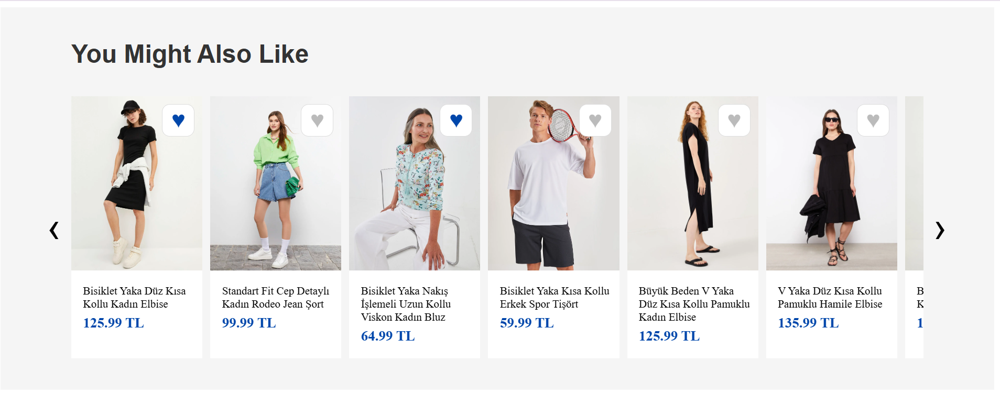

# LCW Product Carousel

This project implements a product carousel for the LC Waikiki website's product pages. The carousel dynamically displays a list of products with the title **"You Might Also Like"** and allows users to interact with it using arrow buttons, clicking to view product pages, and favoriting products.

## Features

- **Dynamic Product List**: Products are retrieved using a `GET` request from a remote JSON file.
- **Product Carousel**: Displays a carousel that shows 6.5 products at once. Users can scroll through the carousel using left and right arrow buttons.
- **Product Interaction**: 
  - Clicking on a product will open its respective page in a new tab.
  - Clicking the heart icon will fill it with blue, indicating the product is favorited.
- **Local Storage**: 
  - Favorited products are stored in the local storage.
  - The application retrieves products from local storage on page reload and ensures favorited items are displayed correctly.
- **Responsive Design**: The carousel is responsive and adjusts according to the screen size (desktop, tablet, and mobile).
- **Fetch Request**: The code initially fetches products from the URL, but on subsequent reloads, it uses the local storage data to avoid unnecessary network calls.

